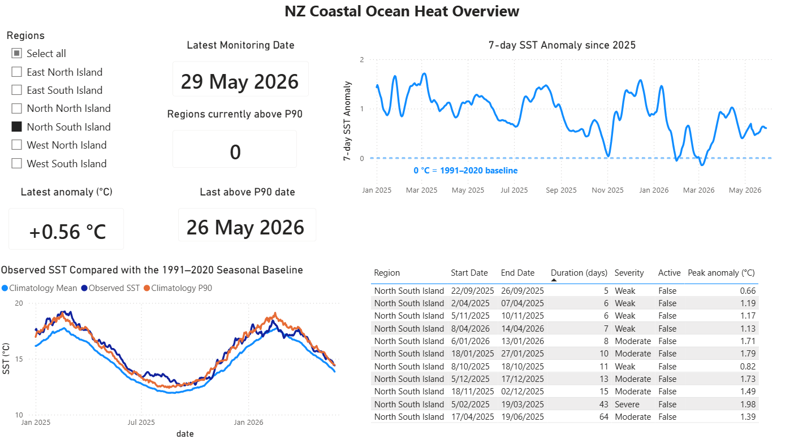
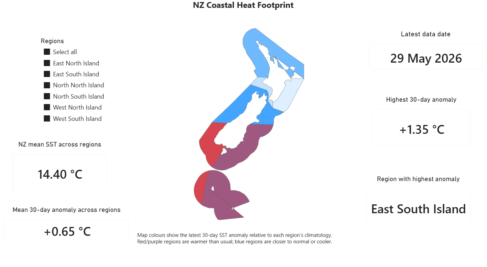
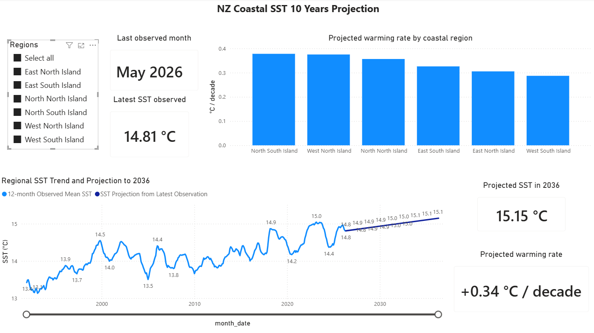

# NZ Coastal Ocean Heat Anomaly Monitor


An end-to-end data engineering project that ingests daily **NOAA Optimum Interpolation Sea Surface Temperature (OISST)** observations, performs geospatial aggregation and anomaly detection, stores analytical outputs in PostgreSQL, and serves interactive monitoring dashboards through Power BI.

The project demonstrates how an environmental monitoring workflow can be designed as a reproducible data pipeline using containerised execution, automated validation, and analytical database modelling.

> **Purpose**
>
> This project is intended to demonstrate data engineering concepts and analytical pipeline design. It is **not** intended to provide an operational climate forecasting service.

---

## Contents

- [What this project demonstrates](#what-this-project-demonstrates)
- [System Architecture](#system-architecture)
- [Scientific Workflow](#scientific-workflow)
- [Dashboard](#dashboard)
- [Technology Stack](#technology-stack)
- [Key Features](#key-features)
- [Review Quick Start](#review-quick-start)
- [Project Overview](#project-overview)
- [Data Source](#data-source)
- [Technical Reference](#technical-reference)
- [Power BI Dashboard](#power-bi-dashboard)
- [Analytical Logic](#analytical-logic)

---

## What this project demonstrates

- End-to-end ETL pipeline for environmental data
- Incremental ingestion of daily NOAA OISST observations
- Geospatial processing using **GeoPandas** and **xarray**
- Regional SST aggregation across six New Zealand coastal regions
- Fixed 1991–2020 climatology baseline
- SST anomaly and marine heat-event detection
- PostgreSQL analytical data warehouse
- Dockerised execution
- Automated testing and validation
- Interactive Power BI reporting

---

## System Architecture

```text
                     NOAA OISST
                         │
                         ▼
                 Python ETL Pipeline
                         │
      ┌──────────────────┴──────────────────┐
      ▼                                     ▼
Parquet Processing Layer              PostgreSQL
                                             │
                                             ▼
                                        Power BI
                                             │
                                             ▼
                                   Monitoring Dashboard

        Docker • Pytest • Validation • Logging
          Windows Task Scheduler (Current)
```

> **Future cloud deployment**
>
> The local scheduling workflow will be migrated to AWS using GitHub Actions, Amazon ECR, EventBridge Scheduler, ECS Fargate, CloudWatch, and Amazon S3.

---

## Scientific Workflow

```text
               NOAA OISST
                    │
                    ▼
      Regional SST Aggregation
                    │
                    ▼
     1991–2020 Climatology Baseline
                    │
                    ▼
         SST Anomaly Calculation
                    │
                    ▼
      Marine Heat-Event Detection
                    │
                    ▼
              PostgreSQL Database
                    │
                    ▼
             Power BI Dashboard
```

---

## Dashboard

<details>
<summary><strong>Dashboard Preview</strong></summary>







</details>

---

## Technology Stack

| Category | Technology |
|-----------|------------|
| Programming | Python 3.11 |
| Data Processing | pandas, GeoPandas, xarray |
| Storage | Parquet |
| Database | PostgreSQL |
| Database Access | SQLAlchemy, psycopg2 |
| Testing | pytest |
| Containers | Docker, Docker Compose |
| Dashboard | Power BI |
| Automation | Windows Task Scheduler |

---

## Key Features

- Incremental daily SST ingestion
- Geospatial aggregation of NOAA OISST observations
- Fixed climatology baseline (1991–2020)
- Regional SST anomaly calculation
- Marine heat-event detection
- PostgreSQL analytical data warehouse
- Automated validation
- Dockerised workflow
- Interactive Power BI dashboard

---

---

## Project Overview

This project is designed as a small production-style environmental monitoring system that tracks sea surface temperature (SST) conditions around New Zealand using NOAA Optimum Interpolation Sea Surface Temperature (OISST) observations.

The pipeline automatically downloads daily SST data, aggregates observations into six New Zealand coastal regions, calculates SST anomalies relative to a fixed **1991–2020 climatology**, detects sustained marine heat events, and loads the analytical outputs into PostgreSQL for visualisation in Power BI.

The project demonstrates how a complete environmental monitoring workflow can be implemented using modern data engineering practices, including reproducible ETL pipelines, automated validation, containerised execution, and analytical database modelling.

### Monitoring Questions

The pipeline is designed to answer practical monitoring questions such as:

- Which New Zealand coastal regions are currently warmer than expected?
- How large are the SST anomalies relative to the long-term climatology?
- Which regions exceed their historical 90th percentile threshold?
- Are any regions experiencing sustained marine heat events?
- How do the latest preliminary observations compare with the validated historical record?
- How have regional SST patterns changed over time?

### Final and Preliminary Monitoring

The monitoring system maintains two complementary data products.

**Final OISST**

The final OISST product provides the validated historical record used for:

- climatology construction
- long-term SST history
- anomaly calculations
- marine heat-event detection
- historical reporting

**Preliminary OISST**

The preliminary OISST product provides the near-real-time monitoring layer used for:

- latest regional SST conditions
- recent anomaly monitoring
- possible active marine heat events
- dashboard status indicators

By combining validated historical observations with recent preliminary data, the dashboard presents both long-term context and the most up-to-date monitoring information.

---

# Data Source

The project uses the **NOAA Optimum Interpolation Sea Surface Temperature (OISST) Version 2.1** dataset, a globally gridded daily sea surface temperature product with a spatial resolution of **0.25° × 0.25°**.

OISST combines observations from satellites, ships, and drifting and moored buoys into a consistent daily SST product, making it well suited for regional environmental monitoring and anomaly detection.

The monitoring pipeline uses two complementary OISST products: **Final OISST** and **Preliminary OISST**.

---

## Final OISST

Final OISST is the validated historical product and forms the foundation of the analytical workflow.

It is used to:

- build the fixed **1991–2020 climatology**
- maintain the validated historical SST record
- calculate long-term SST anomalies
- detect validated marine heat events
- support historical reporting and trend analysis

Because Final OISST undergoes additional quality control, it is treated as the authoritative historical dataset throughout the project.

---

## Preliminary OISST

Preliminary OISST provides the near-real-time monitoring layer.

It is used to:

- monitor the latest regional SST conditions
- calculate recent SST anomalies
- identify potential active marine heat events
- populate the latest dashboard indicators

Preliminary observations are available sooner than the Final product but may be revised when the validated dataset becomes available.

---

## Why both products are used

Environmental monitoring requires both **accuracy** and **timeliness**.

Using only the Final product would provide a reliable historical record but would delay monitoring by several days.

Using only the Preliminary product would provide the most recent observations but would risk incorporating values that may later change after quality control.

For this reason, the pipeline combines both products:

- **Final OISST** provides the validated historical record and climatology.
- **Preliminary OISST** extends the monitoring system with the most recent observations.

This approach allows the dashboard to present stable long-term analyses alongside near-real-time environmental conditions while clearly distinguishing validated and provisional data.

---

# Coastal Regions

The monitoring system aggregates daily sea surface temperature observations into **six broad New Zealand coastal regions**.

Rather than analysing individual OISST grid cells, the pipeline groups observations into regional coastal zones to provide robust, interpretable indicators of large-scale coastal temperature patterns.

| Code | Region |
|------|----------------------|
| NNI | North North Island |
| WNI | West North Island |
| ENI | East North Island |
| NSI | North South Island |
| WSI | West South Island |
| ESI | East South Island |

The region boundaries are defined using custom approximative polygons stored in:

```text
assets/regions/nz_coastal_regions.geojson
```

Because NOAA OISST has a spatial resolution of approximately **0.25° (~25 km)**, the project focuses on **regional coastal monitoring** rather than site-scale or aquaculture farm-scale observations.

The regional approach reduces local noise while providing spatially meaningful indicators suitable for environmental monitoring, anomaly detection, and dashboard reporting.


---

# Architecture

The monitoring system is organised as a multi-stage analytical pipeline that transforms daily NOAA OISST observations into regional monitoring products for PostgreSQL and Power BI.

The workflow consists of five main stages:

1. Data acquisition
2. Regional aggregation
3. Analytical processing
4. Database loading
5. Dashboard reporting

## Pipeline Workflow

```text
                    NOAA OISST
              (Final & Preliminary)
                         │
                         ▼
              Download Daily Files
                         │
                         ▼
          Extract New Zealand Waters
                         │
                         ▼
      Assign Grid Cells to Coastal Regions
                         │
                         ▼
          Aggregate Regional Daily SST
                         │
             ┌───────────┴───────────┐
             │                       │
             ▼                       ▼
      Final OISST             Preliminary OISST
             │                       │
             ▼                       ▼
 1991–2020 Climatology        Recent Monitoring
 Validated SST History        Latest SST Values
             │                       │
             └───────────┬───────────┘
                         ▼
             SST Anomaly Calculation
                         │
                         ▼
          Rolling Monitoring Metrics
                         │
                         ▼
        Marine Heat-Event Detection
                         │
                         ▼
            PostgreSQL Analytics
                         │
                         ▼
             Power BI Dashboard
```

---

## Final OISST Workflow

The Final OISST product provides the validated historical record used throughout the analytical pipeline.

It is responsible for:

- constructing the fixed **1991–2020 climatology**
- maintaining the validated SST history
- calculating historical SST anomalies
- detecting validated marine heat events
- supporting long-term trend analyses

The years **after 2020** are **not** included in the climatology. Instead, they form the post-baseline monitoring period against which anomalies are calculated.

---

## Preliminary OISST Workflow

The Preliminary OISST product extends the monitoring system with the most recent available observations.

It provides:

- latest regional SST conditions
- preliminary anomaly calculations
- possible active marine heat events
- recent dashboard indicators

These observations are considered provisional and may change when the corresponding Final OISST data become available.

---

## Database Outputs

The analytical pipeline produces two complementary datasets.

**Validated historical outputs**

- Regional SST history
- Climatology
- Daily anomalies
- Marine heat events

**Near-real-time monitoring outputs**

- Recent regional SST
- Recent anomalies
- Active event monitoring
- Combined monitoring tables

Power BI connects directly to PostgreSQL, allowing both validated historical analyses and recent monitoring information to be displayed within a single dashboard.

---

# Technical Reference

The following sections describe the implementation details of the project, including the repository structure, data model, database schema, analytical pipeline, validation procedures, automation workflow, and Power BI integration.

These sections are intended for developers or reviewers who wish to understand or reproduce the complete pipeline.

<details>
<summary><strong>Project Structure</strong></summary>

```text
nz-ocean-heat-anomaly-monitor/
│
├── assets/
│   └── regions/
│       ├── nz_coastal_regions.geojson
│       ├── nz_coastal_regions_coastal_powerbi.json
│       └── nz_coastal_regions.qmd
│
├── data/
│   ├── raw/
│   │   ├── oisst/
│   │   ├── oisst_baseline/
│   │   └── oisst_prelim/
│   │
│   └── processed/
│       ├── region_daily_sst_history.parquet
│       ├── region_daily_sst_baseline_1991_2020.parquet
│       ├── region_climatology.parquet
│       ├── region_daily_anomalies.parquet
│       ├── heat_events.parquet
│       ├── region_daily_sst_recent_prelim.parquet
│       ├── region_daily_anomalies_recent_prelim.parquet
│       ├── heat_events_recent_prelim.parquet
│       └── r/
│           └── region_sst_projection_10yr_gls_ar1.csv
│
├── docs/
│   ├── images/
│   └── powerbi_measures.md
│
├── r/
│
├── scripts/
│   ├── setup/
│   ├── monitoring/
│   └── maintenance/
│
├── sql/
│
├── tests/
│
├── nzheat/
│   ├── extract/
│   ├── transform/
│   ├── analytics/
│   ├── pipeline/
│   └── load/
│
├── Dockerfile
├── docker-compose.yml
├── requirements.txt
├── pyproject.toml
├── README.md
```

### Repository organisation

The project is organised into modular components following the main stages of the data pipeline:

| Directory | Purpose |
|-----------|---------|
| `extract/` | Download and read NOAA OISST datasets |
| `transform/` | Regional aggregation and preprocessing |
| `analytics/` | Climatology, anomalies, heat-event detection and projections |
| `pipeline/` | Pipeline orchestration and maintenance workflows |
| `load/` | PostgreSQL loading utilities |
| `tests/` | Automated unit tests |
| `scripts/` | Setup, monitoring and maintenance entry points |
| `sql/` | Database schemas, tables, indexes and views |
| `docs/` | Dashboard images and documentation |

</details>


<details>
<summary><strong>Environment and Database Setup</strong></summary>

## Environment Setup

The project can be run either locally or using Docker. The recommended workflow is Docker, which provides a reproducible environment with PostgreSQL and all required Python dependencies.

### Local Python Environment (optional)

Create and activate a Conda environment:

```powershell
conda create -n nzheat python=3.11
conda activate nzheat
```

Install the project dependencies:

```powershell
pip install -r requirements.txt
```

---

## Docker Setup (recommended)

Copy the example environment file:

```powershell
Copy-Item .env.example .env
```

The default Docker database configuration is:

```env
POSTGRES_DB=nzheat
POSTGRES_USER=postgres
POSTGRES_PASSWORD=postgres
POSTGRES_PORT_HOST=5433

DB_HOST=localhost
DB_PORT=5433
DB_NAME=nzheat
DB_USER=postgres
DB_PASSWORD=postgres
```

Build the Docker images:

```powershell
docker compose build
```

Start PostgreSQL:

```powershell
docker compose up -d postgres
```

Verify that the container is running:

```powershell
docker compose ps
```

Expected port mapping:

```text
localhost:5433 → postgres:5432
```

The Python application container communicates with PostgreSQL using:

```text
postgres:5432
```

Local applications such as pgAdmin and Power BI connect through:

```text
localhost:5433
```

---

## Database Initialisation

The PostgreSQL database is created automatically when the Docker PostgreSQL container starts for the first time.

The SQL scripts in the `sql/` directory are executed in the following order:

```text
01_extensions.sql
02_schema.sql
03_tables.sql
04_index.sql
05_logging_views.sql
```

These scripts create:

- PostgreSQL extensions
- database schemas
- analytical tables
- indexes
- logging views

The project uses four database schemas:

| Schema | Purpose |
|---------|---------|
| `core` | Reference tables |
| `analytics` | Processed analytical outputs |
| `mart` | Dashboard-ready reporting tables |
| `meta` | Pipeline metadata and logging |

---

## Rebuilding the Database

To recreate the PostgreSQL database from scratch:

```powershell
docker compose down -v
docker compose up -d postgres
```

This removes the existing database volume and rebuilds all schemas and tables automatically.

</details>


<details>
<summary><strong>Data Model</strong></summary>

## Overview

The PostgreSQL database is organised into four schemas:

| Schema | Purpose |
|---------|---------|
| `core` | Reference data |
| `analytics` | Processed analytical outputs |
| `mart` | Dashboard-ready reporting tables |
| `meta` | Pipeline metadata and logging |

The analytical workflow follows a simple progression:

```text
Raw NOAA OISST
        │
        ▼
Regional SST
        │
        ▼
Climatology
        │
        ▼
Daily Anomalies
        │
        ▼
Marine Heat Events
        │
        ▼
Power BI Dashboard
```

---

## Reference Tables

### `core.regions`

Stores the six New Zealand coastal regions used throughout the pipeline.

| Field | Description |
|------|-------------|
| `region_id` | Internal region identifier |
| `region_code` | Short region code (NNI, WNI, etc.) |
| `region_name` | Region name |
| `geom_wkt` | Region geometry |

---

## Historical Analytical Tables

### `analytics.region_daily_sst`

Validated daily regional SST observations derived from Final OISST.

| Field | Description |
|------|-------------|
| `date` | Observation date |
| `region_id` | Region identifier |
| `region_code` | Region code |
| `region_name` | Region name |
| `mean_sst_c` | Mean SST (°C) |
| `cell_count` | Number of OISST cells |
| `min_sst_c` | Minimum SST |
| `max_sst_c` | Maximum SST |

---

### `analytics.region_climatology`

Daily climatology calculated from the **1991–2020** baseline.

| Field | Description |
|------|-------------|
| `region_id` | Region identifier |
| `day_of_year` | Day of year (1–365) |
| `clim_mean_sst_c` | Mean climatological SST |
| `clim_p90_sst_c` | 90th percentile SST |
| `sample_size` | Number of observations |

---

### `analytics.region_daily_anomalies`

Daily SST anomalies calculated relative to the fixed climatology.

| Field | Description |
|------|-------------|
| `date` | Observation date |
| `region_id` | Region identifier |
| `day_of_year` | Day of year |
| `mean_sst_c` | Observed SST |
| `clim_mean_sst_c` | Climatological SST |
| `clim_p90_sst_c` | Climatological 90th percentile |
| `anomaly_c` | SST anomaly |
| `rolling_7d_anomaly_c` | 7-day rolling anomaly |
| `rolling_30d_anomaly_c` | 30-day rolling anomaly |
| `warming_rate_7d_c` | Short-term warming rate |
| `above_p90` | Above climatological threshold |
| `status_label` | Monitoring classification |

---

### `analytics.heat_events`

Detected marine heat events.

| Field | Description |
|------|-------------|
| `event_id` | Event identifier |
| `region_id` | Region identifier |
| `event_type` | Event type |
| `severity_class` | Severity classification |
| `start_date` | Event start |
| `end_date` | Event end |
| `duration_days` | Event duration |
| `max_anomaly_c` | Maximum anomaly |
| `mean_anomaly_c` | Mean anomaly |
| `peak_date` | Peak warming |
| `is_active` | Active event flag |
| `threshold_c` | Threshold SST |
| `min_duration_days` | Minimum qualifying duration |

---

## Preliminary Monitoring Tables

The preliminary monitoring tables mirror the validated analytical tables but contain the latest provisional OISST observations.

These tables include:

```text
analytics.region_daily_sst_prelim

analytics.region_daily_anomalies_prelim

analytics.heat_events_prelim
```

Additional metadata identifies these records as preliminary:

```text
data_product = preliminary

is_provisional = true
```

These tables support the real-time monitoring pages within the Power BI dashboard.

---

## Climatology

The climatology is constructed from validated Final OISST observations between:

```text
1991-01-01
↓

2020-12-31
```

The climatology is calculated independently for every:

```text
Region
×

Day of Year
```

Expected output:

```text
365 days × 6 regions

= 2,190 climatology records
```

Each climatology value is calculated from approximately **30 years of observations**.

---

## Leap-Year Handling

The climatology uses a **365-day calendar**.

To maintain alignment between leap and non-leap years:

- February 29 is removed.
- Dates after February 29 in leap years are shifted back by one day.

This ensures each climatology value always compares equivalent calendar days across years.

</details>


<details>
<summary><strong>Main Pipeline Commands</strong></summary>

## Pipeline Overview

The project consists of four main workflows:

1. **Initial setup** *(run once)*
2. **Daily monitoring** *(run routinely)*
3. **Exploratory analyses** *(optional)*
4. **Maintenance and validation** *(as required)*

---

# 1. Initial Setup

These commands are only required when building the project from scratch.

---

## Build the 1991–2020 Climatology

```powershell
python scripts\setup\build_1991_2020_climatology.py
```

Creates:

```text
data/processed/region_daily_sst_baseline_1991_2020.parquet

data/processed/region_climatology.parquet
```

This step processes approximately 30 years of OISST observations and normally only needs to be run once.

---

## Build the 2021–2024 Historical Record

```powershell
python scripts\setup\build_gap_2021_2024_history.py
```

Creates:

```text
data/processed/region_daily_sst_gap_2021_2024.parquet
```

These observations form the validated post-baseline monitoring period.

---

# 2. Daily Monitoring Workflow

The daily monitoring workflow keeps both the validated historical record and the near-real-time monitoring layer up to date.

---

## Update Final OISST

```powershell
python scripts\monitoring\run_daily_append.py
```

This workflow:

- checks for newly available Final OISST observations
- appends only missing dates
- recalculates anomalies
- recalculates marine heat events
- reloads PostgreSQL analytical tables

Updated output:

```text
data/processed/region_daily_sst_history.parquet
```

---

## Update Preliminary OISST

```powershell
python scripts\monitoring\run_preliminary_update.py

python -m nzheat.load.load_preliminary_postgres
```

Creates:

```text
region_daily_sst_recent_prelim.parquet

region_daily_anomalies_recent_prelim.parquet

heat_events_recent_prelim.parquet
```

These outputs populate the near-real-time monitoring layer.

---

## Build the Monitoring Dataset

```powershell
python scripts\monitoring\build_and_load_monitoring_anomalies.py
```

Combines Final and Preliminary anomalies into a single monitoring table used by Power BI.

---

# 3. Historical Rebuild

If the climatology or historical SST records are modified, regenerate downstream products:

```powershell
python scripts\maintenance\run_final_refresh.py
```

or manually:

```powershell
python -m nzheat.analytics.anomalies

python -m nzheat.analytics.events

python -m nzheat.load.load_postgres
```

This refreshes:

- anomalies
- heat events
- PostgreSQL analytical tables

---

# 4. 10-Year Projection

The project includes two independent projection workflows.

## Production Workflow (Python)

Build the historical SST dataset:

```powershell
python -m nzheat.analytics.build_full_sst_history
```

Generate the projection:

```powershell
python -m nzheat.analytics.projection_10yr
```

Load into PostgreSQL:

```powershell
python -m nzheat.load.load_projection_10yr_to_postgres
```

Power BI reads this PostgreSQL table directly.

---

## Exploratory Workflow (R)

Fit the GLS AR(1) model:

```powershell
Rscript r\fit_gls_projection_10yr.R
```

Create visualisations:

```powershell
Rscript r\plot_gls_projection_10yr.R
```

This workflow is provided for comparison and exploratory modelling only.

---

# 5. Validation

Run the validation suite:

```powershell
python scripts\maintenance\validate_outputs.py
```

Validation checks include:

- duplicate observations
- missing dates
- missing regions
- missing anomaly values
- climatology completeness
- active heat events
- latest available observations

Expected climatology:

```text
Rows: 2190

Regions: 6

Days: 365

Missing values: 0
```

---

# 6. Maintenance Backfill

Backfill is only required when historical observations are missing.

Example:

```powershell
python -m nzheat.pipeline.backfill ^
--start-date 2026-05-05 ^
--end-date 2026-05-06
```

After backfilling:

```powershell
python -m nzheat.analytics.anomalies

python -m nzheat.analytics.events

python -m nzheat.load.load_postgres

python scripts\monitoring\build_and_load_monitoring_anomalies.py

python scripts\maintenance\validate_outputs.py
```

</details>

<details>
<summary><strong>Testing</strong></summary>

## Testing

The project includes an automated **pytest** suite covering the core components of the analytical pipeline.

Current test coverage includes:

| Component | Purpose |
|-----------|---------|
| Regional aggregation | Validates assignment of OISST grid cells to coastal regions |
| SST anomalies | Verifies climatology and anomaly calculations |
| Marine heat events | Validates event detection logic |
| OISST extraction | Checks filename parsing and extraction workflows |
| 10-year projection | Validates projection output structure |
| Project utilities | Tests project paths and helper functions |

---

### Run the complete test suite

```powershell
python -m pytest -q
```

or inside Docker:

```powershell
docker compose run --rm app python -m pytest -q
```

Expected output:

```text
36 passed
```

---

### Run a single test

Example:

```powershell
python -m pytest tests\test_events.py -q
```

---

### Verify that all modules compile

```powershell
python -m compileall nzheat scripts
```

This command performs a syntax check across the project and is useful after larger code changes.

---

### Validation

In addition to unit tests, the project includes a validation workflow that checks the integrity of analytical outputs before they are loaded into PostgreSQL.

Run:

```powershell
python scripts\maintenance\validate_outputs.py
```

Validation includes checks for:

- duplicate observations
- missing dates
- missing region/date combinations
- missing anomaly values
- climatology completeness
- active marine heat events

These checks provide an additional safeguard beyond the unit test suite by validating generated datasets rather than individual functions.

</details>


<details>
<summary><strong>Pipeline Scheduling</strong></summary>

## Pipeline Scheduling

The monitoring pipeline is designed to run automatically on a regular schedule.

The current implementation uses **Windows Task Scheduler**, which executes the daily update workflow through a batch script.

```
daily_update.bat
```

The batch script performs the following steps:

1. Opens the project directory
2. Activates the `nzheat` Conda environment
3. Updates the validated Final OISST record
4. Updates the latest Preliminary OISST observations
5. Loads the latest analytical outputs into PostgreSQL
6. Refreshes the monitoring tables used by Power BI
7. Writes execution logs

---

## Daily Workflow

The scheduled pipeline performs two independent update processes.

### Final OISST Update

```
scripts/monitoring/run_daily_append.py
```

This workflow:

- checks whether new validated OISST observations are available
- appends only new dates
- recalculates anomalies
- recalculates marine heat events
- reloads analytical PostgreSQL tables

---

### Preliminary OISST Update

```
scripts/monitoring/run_preliminary_update.py

python -m nzheat.load.load_preliminary_postgres
```

This workflow updates the near-real-time monitoring layer by:

- downloading the latest preliminary observations
- recalculating preliminary anomalies
- updating active marine heat events
- loading the monitoring tables into PostgreSQL

These data populate the latest dashboard indicators until validated Final OISST observations become available.

---

## Monitoring Table Refresh

The combined monitoring dataset is rebuilt using:

```powershell
python scripts\monitoring\build_and_load_monitoring_anomalies.py
```

This table merges validated historical observations with the latest preliminary monitoring data and is the primary data source for the Power BI monitoring pages.

---

## Logging

Pipeline execution writes log files to:

```text
logs/daily_update.log
```

The latest log entries can be viewed with:

```powershell
Get-Content logs\daily_update.log -Tail 40
```

A successful execution should include messages similar to:

```text
Running run_daily_append.py

Running run_preliminary_update.py

Loaded rows into analytics.heat_events_prelim

Daily update finished
```

---

## Future Improvements

The current local scheduler is intended as a lightweight automation solution.

Future versions of the project will replace Windows Task Scheduler with a cloud-native scheduling workflow based on:

- GitHub Actions
- Amazon EventBridge Scheduler
- Amazon ECS Fargate
- Amazon CloudWatch

This will allow the pipeline to run automatically without relying on a local machine.

</details>


---

# Power BI Dashboard

The Power BI dashboard provides an interactive interface for exploring regional sea surface temperature conditions around New Zealand.

It combines validated historical observations with the latest preliminary monitoring data to support both long-term environmental assessment and near-real-time monitoring.

The dashboard is organised into three complementary pages.

---

## 1. Monitoring Overview

This page summarises the current state of coastal sea surface temperatures across New Zealand.

It provides a high-level overview of recent SST anomalies, short-term trends, and possible active marine heat events.

Key outputs include:

- latest regional SST anomalies
- rolling 7-day and 30-day anomaly trends
- current monitoring status
- possible active marine heat events
- recent regional comparisons

This page is designed to answer questions such as:

- Which regions are currently warmer than expected?
- Where are the strongest SST anomalies?
- Are any marine heat events currently active?

---

## 2. 10-Year SST Projection

This page presents recent SST observations alongside an exploratory 10-year projection.

The projection is intended to illustrate how recent regional warming trends may continue under a simple trend-based scenario.

It is **not** presented as a climate forecast.

Key outputs include:

- historical regional SST
- projected SST trends
- comparison between observed and projected values

This page supports exploratory assessment of potential future regional warming patterns.

---

## 3. NZ Coastal Heat Footprint

This page visualises the latest regional SST anomalies on a custom New Zealand coastal map.

Regions are coloured according to their latest **30-day SST anomaly**, allowing rapid identification of coastal areas experiencing sustained warming.

Using anomalies rather than absolute temperatures avoids confusing naturally warmer northern waters with regions experiencing unusually warm conditions relative to their historical climatology.

This page is designed to answer questions such as:

- Which coastal regions are experiencing the strongest warming?
- How is warming distributed around New Zealand?
- Which regions are currently above their normal seasonal conditions?

---

## Dashboard Design Principles

The dashboard is built around three core principles.

### Separate absolute temperature from anomalies

Absolute SST and SST anomalies are presented separately because naturally warmer regions are not necessarily experiencing stronger warming relative to their historical climate.

---

### Combine validated and recent observations

Historical analyses use validated Final OISST observations, while the monitoring layer incorporates Preliminary OISST to provide the most up-to-date regional conditions.

---

### Support environmental monitoring

The dashboard is intended as a monitoring tool rather than a forecasting system, allowing users to quickly identify unusual regional warming patterns while retaining historical context.


---

# Analytical Logic

The monitoring system is built around a fixed climatological baseline and a series of analytical transformations that convert daily sea surface temperature observations into regional monitoring indicators.

The analytical workflow follows five main steps:

1. Build a fixed climatology
2. Calculate daily SST anomalies
3. Calculate rolling monitoring metrics
4. Detect marine heat events
5. Generate dashboard-ready analytical products

---

## Fixed Climatology Baseline

The project uses a fixed **1991–2020 climatology** as the reference period for all anomaly calculations.

The climatology represents the expected seasonal SST cycle for each coastal region and each day of the year.

Only observations between:

```text
1991-01-01

↓

2020-12-31
```

are used to construct the climatology.

Final OISST observations from **2021 onward** are treated as the post-baseline monitoring period and are compared against the fixed climatology.

Using a fixed baseline ensures that changes observed after 2020 represent departures from a stable historical reference rather than a continually shifting average.

---

## SST Anomaly Calculation

Daily SST anomalies are calculated as:

```text
SST Anomaly = Observed SST − Climatological Mean SST
```

where:

- **Observed SST** is the regional daily mean SST
- **Climatological Mean SST** is the expected SST for the same region and day of year based on the 1991–2020 climatology

Positive anomalies indicate warmer-than-expected conditions, while negative anomalies indicate cooler-than-expected conditions.

---

## Climatological Threshold

For each region and day of year, the pipeline also calculates a climatological **90th percentile threshold**.

```text
clim_p90_sst_c
```

A day is classified as unusually warm when:

```text
Observed SST > Climatological 90th Percentile
```

This threshold provides a seasonally adjusted definition of unusually warm conditions rather than relying on absolute SST values.

---

## Rolling Monitoring Metrics

To distinguish short-term variability from sustained warming, the monitoring pipeline calculates several rolling metrics.

These include:

```text
rolling_7d_anomaly_c

rolling_30d_anomaly_c

warming_rate_7d_c
```

These metrics support:

- short-term monitoring
- persistent warming assessment
- dashboard visualisation
- marine heat-event detection

The 30-day anomaly is also used to generate the NZ Coastal Heat Footprint map.

---

## Marine Heat Events

Marine heat events are identified using sustained periods during which regional SST exceeds the climatological 90th percentile.

Each detected event includes:

```text
start_date

end_date

duration_days

peak_date

max_anomaly_c

mean_anomaly_c

severity_class

is_active
```

Separate event tables are maintained for:

- validated Final OISST observations
- Preliminary OISST monitoring observations

This allows recent events to be monitored while maintaining a validated historical event record.

---

## Monitoring Strategy

The project separates historical analysis from operational monitoring.

**Validated historical analysis**

- Final OISST
- Fixed climatology
- Historical anomalies
- Validated marine heat events

**Operational monitoring**

- Preliminary OISST
- Latest SST observations
- Recent anomaly calculations
- Possible active marine heat events

This separation allows the dashboard to present stable historical analyses while simultaneously providing the most recent environmental conditions.

---

## Dashboard Interpretation

The dashboard is designed to support interpretation rather than prediction.

Several design principles are followed:

- SST anomalies are presented separately from absolute SST.
- Historical analyses always use validated Final OISST observations.
- Recent monitoring uses Preliminary OISST observations.
- Regional anomalies are interpreted relative to each region's historical climatology.

These design choices help distinguish naturally warm regions from regions experiencing unusually warm conditions.

---

## 10-Year Projection

The 10-year projection is included as an exploratory analytical product.

It extends recent regional SST behaviour using trend-based modelling to illustrate how current warming patterns may evolve under a simple continuation scenario.

The projection is intended to support interpretation of recent warming trends and is **not** presented as a climate forecast.

The repository includes two independent implementations:

- **Python**, used for the production PostgreSQL workflow and Power BI dashboard
- **R (GLS AR(1))**, included as an exploratory statistical comparison

The Power BI dashboard uses the Python-generated projection loaded into PostgreSQL.

---