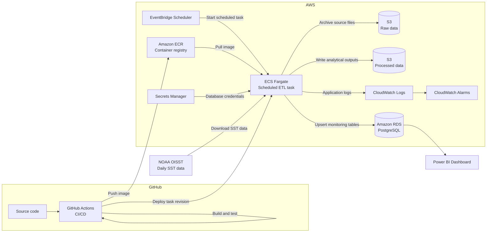

# System Architecture

The NZ Coastal Ocean Heat Anomaly Monitor is a scheduled batch-processing
pipeline that downloads NOAA OISST data, calculates coastal temperature
anomalies and marine heatwave indicators, stores analytical outputs, and
publishes the results through Power BI.

## Target AWS architecture

## Processing flow

1. EventBridge Scheduler starts an ECS Fargate task.
2. Fargate pulls an immutable Docker image from Amazon ECR.
3. The pipeline checks the latest successfully processed date.
4. New NOAA OISST files are downloaded.
5. Source data are archived in Amazon S3.
6. Coastal SST anomalies and event indicators are calculated.
7. Validated outputs are written to S3 and PostgreSQL.
8. Application logs are sent to CloudWatch.
9. Power BI reads the published monitoring tables.

## Design decisions

### Scheduled Fargate task

The pipeline is a batch workload. It starts, processes available data, writes
the results, and exits. A continuously running ECS service is therefore not
required.

### Immutable container images

Each deployment will be tagged with the Git commit SHA. This allows every ECS
execution to be traced to the exact source-code revision that produced it.

### Separate storage layers

- S3 raw layer: original downloaded data.
- S3 processed layer: validated analytical outputs.
- PostgreSQL serving layer: tables optimized for Power BI.

### Idempotent processing

Running the pipeline more than once for the same date must not create duplicate
records. Database writes should use transactions and deterministic upserts.

### Secrets management

Production credentials will be stored in AWS Secrets Manager. Passwords will
not be committed to GitHub or included in container images.

### Observability

The application will write structured logs to standard output. ECS will send
these logs to CloudWatch, where failures and missing scheduled executions can
trigger alarms.